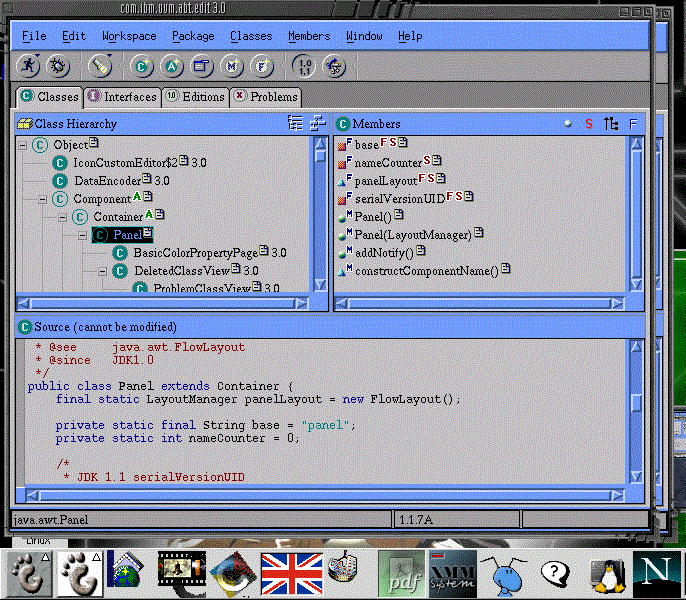

## Hi there:

My name is Martin Ortega-Marquez, I'm a software engineer.
I started out as a English literature student, but while studying at Facultad de Filosofia y letras UNAM, discovered the joys of programming then I decided
to study administrative systems in Universidad del Valle de Mexico UVM.
I currently hold a master degree of sytems engineering from Universidad del Valle de Mexico UVM.

For the past twelve years, I had architected and developed software for a variety of industries, including banking industry, insurance companies and goverment ministries.

The technologies I usually use for building products:
<table width="100%">
<tr>
	<td><b>Programming</b></td>
	<td><b>Databases</b></td>
	<td><b>Communications</b></td>
	<td><b>Design</b></td>
</tr>
<tr>
	<td>
	

		<ul>
			<li>C#</li>
			<li>Bash</li>
			<li>Python</li>
			<li>JS</li>
		</ul>
		

	</td>
	<td>
	

		<ul>
			<li>PostgreSQL</li>
			<li>Oracle</li>
			<li>Sql Server</li>
		</ul>
	

	</td>
	<td>
	

		<ul>
			<li>Asp.net</li>
			<li>WCF</li>
			<li>Socket</li>
		</ul>
		

	</td>
	<td>
	

		<ul>
			<li>OOP</li>
			<li>Patterns</li>
			<li>Security</li>
		</ul>
	

	</td>
</tr>
</table>

<a href="https://www.credly.com/users/martin-ortega-marquez">Credly</a>
<!--
**lynxestudio/lynxestudio** is a ✨ _special_ ✨ repository because its `README.md` (this file) appears on your GitHub profile.

Here are some ideas to get you started:
-->

