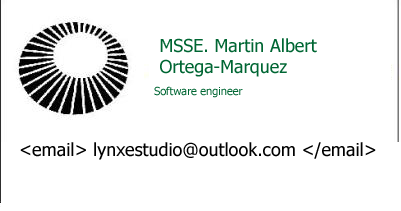

## Hi there:

My name is Martin Ortega-Marquez, I'm a software engineer.
I started out as a English literature student, but while studying at Facultad de Filosofia y letras UNAM, discovered the joys of programming then I decided
to study administrative systems in Universidad del Valle de Mexico UVM.
I currently hold a master degree of sytems engineering from Universidad del Valle de Mexico UVM.

For the past twelve years, I had architected and developed software for a variety of industries, including banking industry, insurance companies and goverment ministries.
<table>
<tr>
<td></td>
<td>

</td>
</tr>
</table>

<!--
**lynxestudio/lynxestudio** is a ✨ _special_ ✨ repository because its `README.md` (this file) appears on your GitHub profile.

Here are some ideas to get you started:
-->

